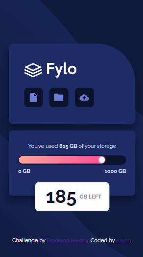
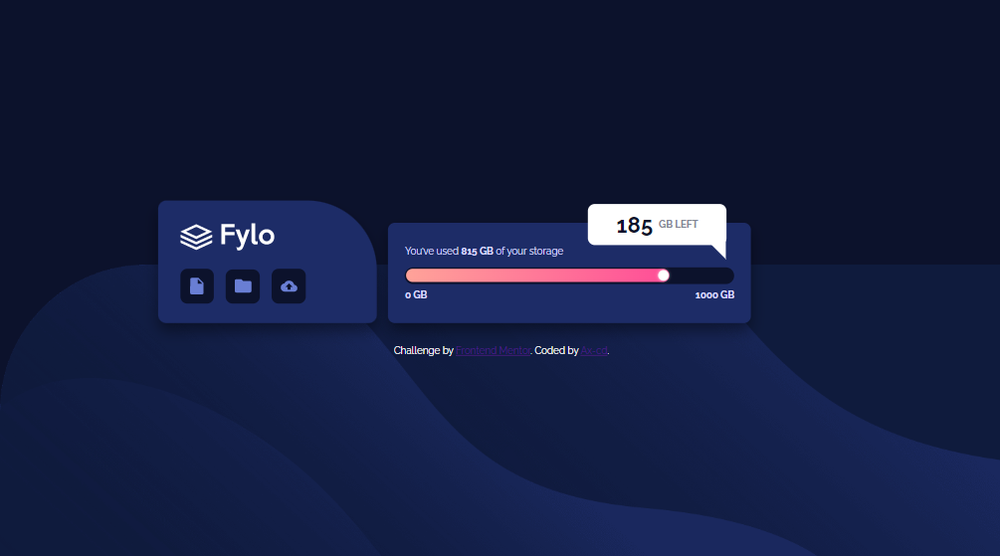

# Frontend Mentor - Fylo data storage component solution

This is a solution to the [Fylo data storage component challenge on Frontend Mentor](https://www.frontendmentor.io/challenges/fylo-data-storage-component-1dZPRbV5n). Frontend Mentor challenges help you improve your coding skills by building realistic projects.

## Table of contents

- [Overview](#overview)
  - [The challenge](#the-challenge)
  - [Links](#links)
  - [Screenshot](#screenshot)
    - [Mobile design](#mobile-design)
    - [Desktop design](#desktop-design)
- [My process](#my-process)
  - [Built with](#built-with)
- [Author](#author)

## Overview

### The challenge

Users should be able to:

- View the optimal layout for the site depending on their device's screen size

### Links

- Solution URL: [Frontend Mentor](https://www.frontendmentor.io/solutions/fylo-data-storage-with-css-animation-NWu1yIDYQv)
- Live Site URL: [GitHub Page](https://ax-cd.github.io/fylo-data-storage-component-challenge/)

### Screenshot

#### Mobile design

#### Desktop design

## My process

### Built with

- HTML5
- CSS custom properties
- Flexbox
- Mobile-first workflow

## Author

- GitHub - [Ax-cd](https://github.com/Ax-cd)
- Frontend Mentor - [@Ax-cd](https://www.frontendmentor.io/profile/Ax-cd)
